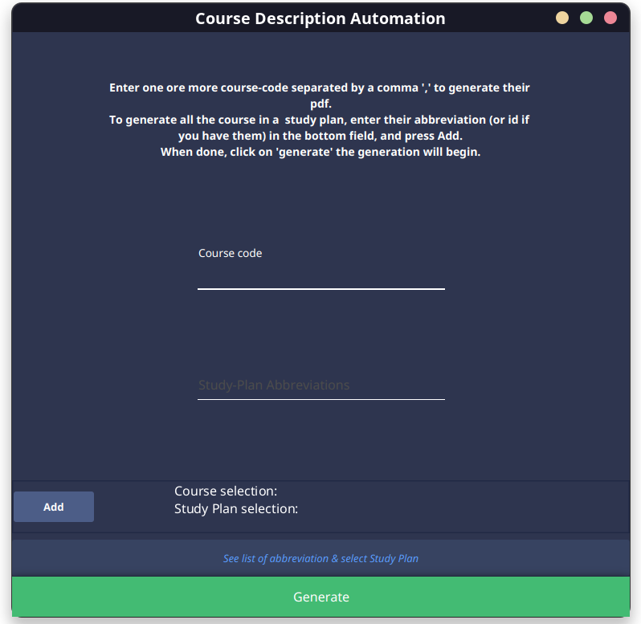
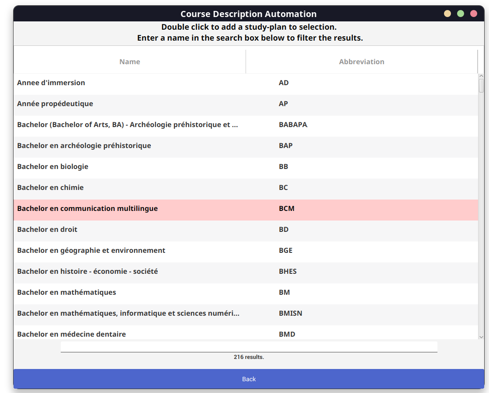

# Fancy-Login-Form

[Course-Description-Automation](https://github.com/David-Kyrat/Course-Description-Automation) Project directly integrated with the gui,
refactored 100% in scala / integrated java.
(no more jar from a separate project for the gui and no more Rust)


<p align="center">
  

  
</p>


## Running the project

```bash
git clone https://github.com/David-Kyrat/cda_v2_scala.git
cd cda_v2_scala
make run
```

or manually

```bash
git clone https://github.com/David-Kyrat/cda_v2_scala.git
cd cda_v2_scala
mvn clean package
java -jar target/cda-jar-with-dependencies.jar
```

## Building the fat jar

```bash
make
```

file is located in `target/cda.jar`
