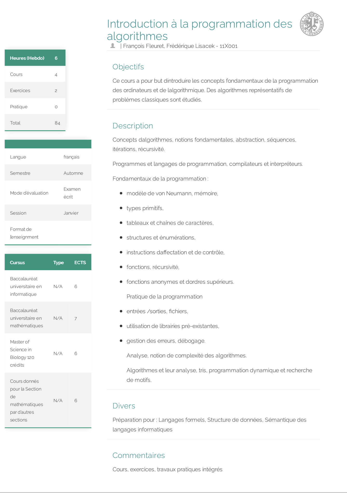

# UNIGE Administration Project | Course Description Automator

Application to automatically generate printable 1-2 page PDF of course descriptions.

> V2 of repository *[Course-Description-Automation](https://github.com/David-Kyrat/Course-Description-Automation). Project directly integrated with the gui,
> refactored 100% in scala / integrated java for more coherence, stability and ease of deployment.
> (no more jar from a separate project for the gui and no more Rust)*

<div align="center">

Made with:

<a href="https://unige.ch/"></a>


### UI Screenshot

<p align="center">
  

  
</p>

### Output Example

<p align="center">

</p>

</div>

## Dependencies

- Java 17 (Liberica's JDK) (Installable with sdkman, see `./setup` script)
- Pandoc 
- Wkhtmltopdf

The JDK needs to be specifically Liberica's one as it contains JavaFX, and does the linking of that library for us (i.e. no need to add cli options when running / compiling).

It should work for Java >17 but has not been tested.


## Running the project

```bash
git clone https://github.com/David-Kyrat/cda_v2_scala.git
cd cda_v2_scala
# If you don't have Liberica's JDK for java17 installed (needs to be specifically Liberica's one as it contains JavaFX, and does the linking for us)
./setup
make run
```

or manually, if you have maven installed:

```bash
git clone https://github.com/David-Kyrat/cda_v2_scala.git
cd cda_v2_scala
./setup 
mvn clean package
java -jar target/cda-jar-with-dependencies.jar
```

## Building the fat jar

```bash
make
```

file is located in `target/cda.jar`
